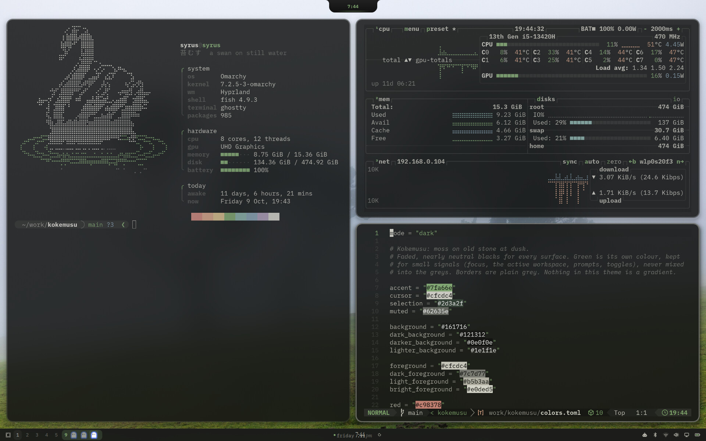
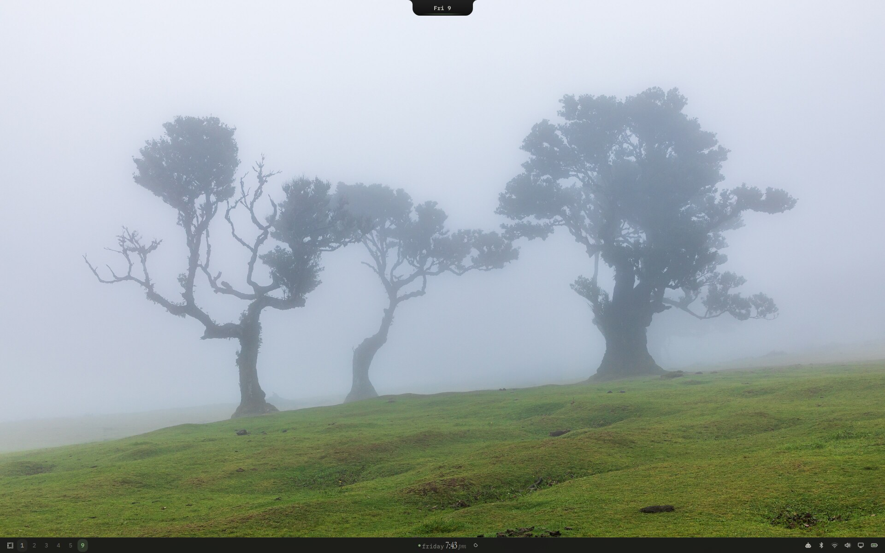
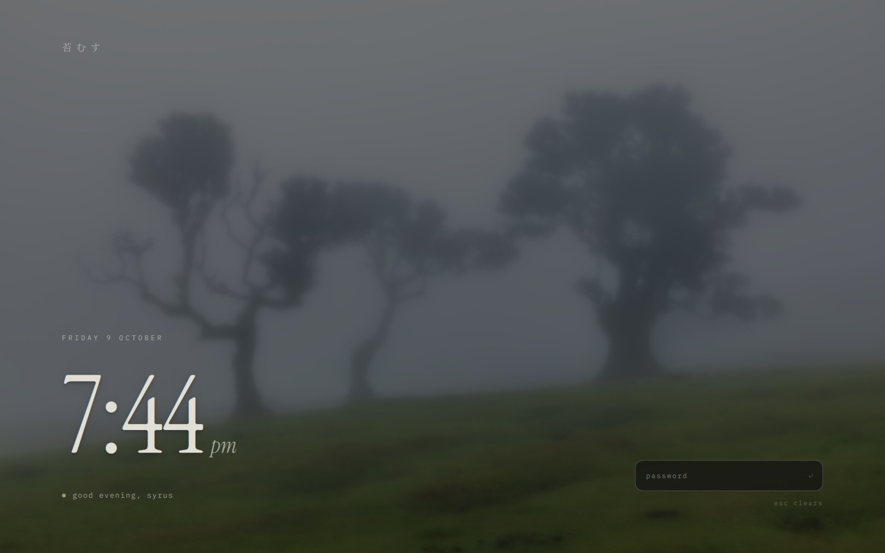
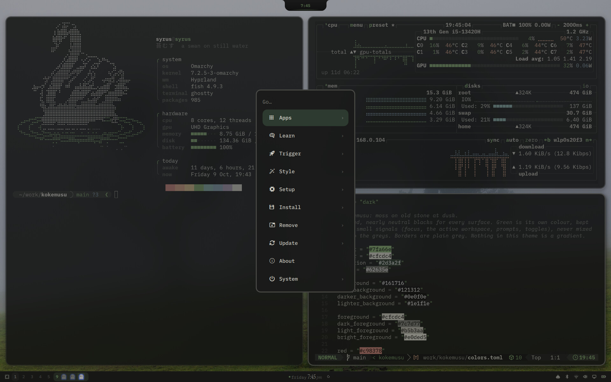
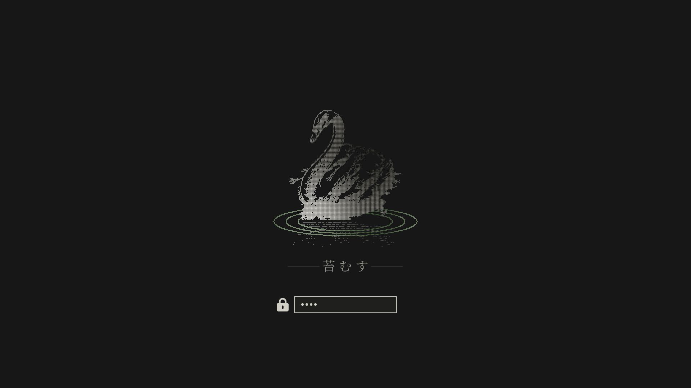
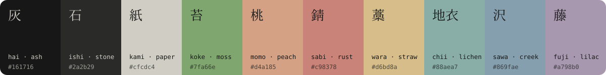
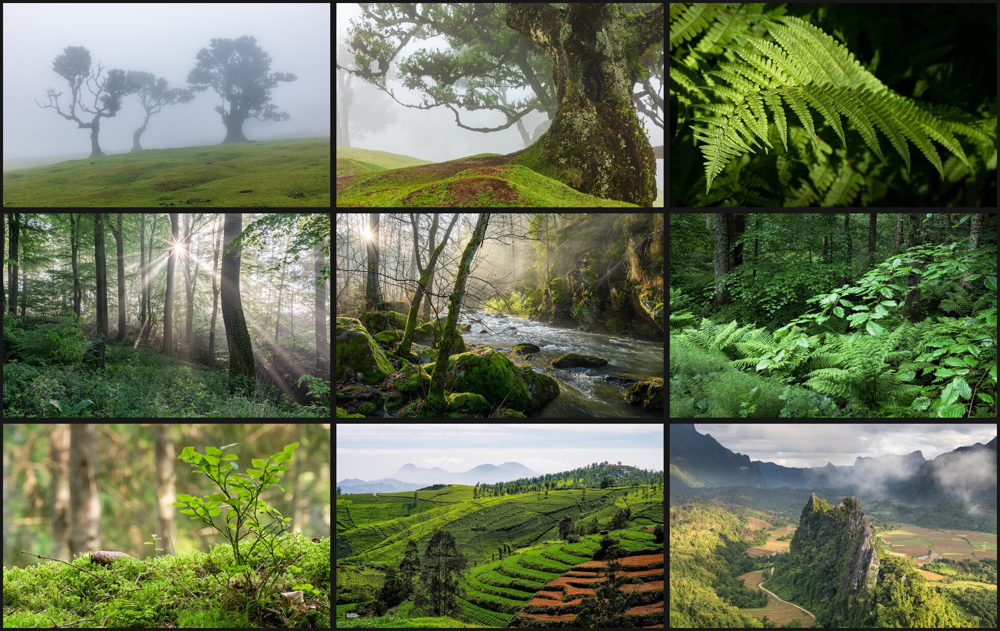

<div align="center">



<br>

<p><a href="#導入--install"></a>&nbsp;<a href="#色--palette"></a>&nbsp;<a href="#壁紙--wallpapers"></a>&nbsp;<a href="LICENSE"></a></p>

<b>苔むした石に、静かな朝を。</b><br>
<sub><i>A quiet morning on moss-covered stone.</i></sub>

```bash
omarchy theme install https://github.com/Arjun010011/kokemusu
```

<br>



<sub>fastfetch · btop · Neovim, with the bar below and the Dynamic Island above</sub>

</div>

<br>


## 物語 · The story

In the old gardens of Kyoto, moss is not planted. It is waited for. A stone is set
down, the ground is swept and kept damp, and over the years the green arrives on its
own: first in the cracks, then over the shoulders of the stone, until the stone looks
as if it was always soft. Japanese has one word for that slow arrival: **苔むす**,
*kokemusu*, to become covered in moss.

[Tsukiyo](https://github.com/Arjun010011/omarchy-tsukiyo-theme) was a theme for the
hours after midnight. Kokemusu is the morning after. You closed the laptop, went
outside, and stood in a foggy laurel forest long enough to notice the moss.

The desktop keeps that feeling. Its blacks are faded, like stone left out in the rain.
Its borders are plain grey. Green appears only where something is alive: the workspace
you are on, the switch you turned on, the prompt waiting for you. Nothing is a
gradient; every surface is one flat, honest colour. And on still water there is a
swan, ringed by slow ripples. It greets you when you open a terminal, and again when
the machine boots.


## 景 · A look around

<table>
<tr><td>

**机 &nbsp;Desktop**<br>
<sub>The bare desktop: one flat charcoal bar, a serif clock with a single moss dot, hairline status icons, and fog over the laurels of Fanal.</sub>

</td></tr>
<tr><td></td></tr>
<tr><td>

**錠 &nbsp;Lock screen**<br>
<sub>The wallpaper under one flat veil, a large serif time set low on the left like the corner of a print, 苔むす in the margin, and a solid password card with a grey border. Moss shows only as one small dot.</sub>

</td></tr>
<tr><td></td></tr>
<tr><td>

**品 &nbsp;Menus**<br>
<sub>Grey borders everywhere; moss marks the row you are on.</sub>

</td></tr>
<tr><td></td></tr>
<tr><td>

**起 &nbsp;Boot screen**<br>
<sub>The swan on still water, drawn in fine dots with moss ripples and a broken reflection, above 苔むす. The same swan floats in fastfetch.</sub>

</td></tr>
<tr><td></td></tr>
</table>


## 趣 · What's inside

| | Part | What it does |
|:-:|---|---|
| **帯** | **Bar** | One flat full-width charcoal strip with a hairline that turns faintly moss on hover. Hand-drawn hairline icons for Wi-Fi, Bluetooth, volume, display and battery; indicator icons centred on their actual ink so nothing sits a pixel off. |
| **時** | **Clock** | Lowercase weekday in the mono font, the time in Instrument Serif, an italic meridiem, and one moss dot. |
| **錠** | **Lock screen** | Flat veil, serif time in the lower left, solid password card, grey in every state and rust only on a wrong password. |
| **鳥** | **Swan** | A swan on still water with moss ripple rings and a wavering reflection, in fastfetch (fits a half-screen terminal) and on the boot screen. |
| **計** | **btop** | Grey boxes and one flat colour per meter: moss cpu, lichen memory, creek download, peach upload and temperature. |
| **動** | **Motion** | Windows rise a little as they open, workspaces slide and fade, unfocused windows dim slightly, solid borders. |
| **筆** | **Editors & apps** | Hand-tuned Neovim (with a matching statusline), Ghostty, Kitty, Alacritty and Foot; Zed, opencode, Zen browser, GTK 3/4, fish and Tide, tmux, starship, eza (moss folders), lazygit, yazi and cava. |
| **字** | **Type** | BlexMono Nerd Font (IBM Plex Mono) for the system; Instrument Serif for the clock and lock screen. |
| **壁** | **Wallpapers** | Nine 4K greenery photographs: fog, ferns, moss, laurel forests, a mossy stream, tea hills and misty karst peaks. |


## 導入 · Install

**一 &nbsp;The theme.** Everything Omarchy themes itself: Hyprland, the shell (bar, menus,
notifications, popups), terminals, Neovim, btop, Chromium and more.

```bash
omarchy theme install https://github.com/Arjun010011/kokemusu
```

**二 &nbsp;The rest of the desktop, in one step.** The bar, clock, icons, lock screen,
fonts, swan and every app listed above. Each file it replaces is backed up first, it
never needs sudo, and it never changes your cursor theme.

```bash
~/.config/omarchy/themes/kokemusu/install-extras.sh           # install
~/.config/omarchy/themes/kokemusu/install-extras.sh --remove  # undo it all
```

<sub>Omarchy drops a cloned theme's `.lua` files, so this also adds a small loader that brings
back Kokemusu's Hyprland motion and Neovim colours, only while Kokemusu is the active theme.
The bar, clock and indicators are rebuilt from Omarchy's own files plus a small patch, so
they keep working the same way whichever theme patched them before.</sub>

**三 &nbsp;The boot screen.** The swan on the disk-unlock screen:

```bash
omarchy plymouth set by theme kokemusu
```


## 色 · Palette



<sub>Three rules: the greys and the green never blend into each other; borders and focus rings stay grey; every surface and every meter is one flat colour. Moss is spent sparingly, on the few things that are alive.</sub>


## 壁紙 · Wallpapers



Nine photographs from Wikimedia Commons, chosen for calm: places you could stand in for
a while and breathe. All are 3840 px wide and otherwise unedited. Pick one with the
background switcher.

| | Wallpaper | Photographer | Licence |
|:-:|---|---|---|
| 1 | [Fog in the laurel forest of Fanal, Madeira](https://commons.wikimedia.org/wiki/File:Fanal_(Madeira,_Portugal),_Lorbeerwald_--_2025_--_1532.jpg) | Dietmar Rabich | CC BY-SA 4.0 |
| 2 | [An old laurel in Fanal](https://commons.wikimedia.org/wiki/File:Fanal_(Madeira,_Portugal),_Lorbeerwald_--_2025_--_1546.jpg) | Dietmar Rabich | CC BY-SA 4.0 |
| 3 | [Lady fern at Myrstigen trail](https://commons.wikimedia.org/wiki/File:Lady_fern_at_Myrstigen_trail_1.jpg) | W.carter | CC0 |
| 4 | [Sunlit beech wood, Roruper Holz](https://commons.wikimedia.org/wiki/File:D%C3%BClmen,_Rorup,_NSG_Roruper_Holz_--_2021_--_8187-91.jpg) | Dietmar Rabich | CC BY-SA 4.0 |
| 5 | [Sunrise over a mossy stream, Höllental](https://commons.wikimedia.org/wiki/File:Sonnenaufgang_im_H%C3%B6llental_(Frankenwald)_191220-0135-HDR.jpg) | Burnett0305 | CC BY-SA 4.0 |
| 6 | [Beech and ferns in Gullmarsskogen](https://commons.wikimedia.org/wiki/File:Beech_and_ferns_in_Gullmarsskogen.jpg) | W.carter | CC0 |
| 7 | [Bilberry and moss in Gullmarsskogen ravine](https://commons.wikimedia.org/wiki/File:Bilberry_bush_and_moss_in_Gullmarsskogen_ravine.jpg) | W.carter | CC0 |
| 8 | [Tea fields of the Nilgiris](https://commons.wikimedia.org/wiki/File:Vegetables_Tea_Fields_Nilgiris_Nov25_A7CR_09820-4_HDR1.jpg) | Timothy A. Gonsalves | CC BY-SA 4.0 |
| 9 | [Green karst peaks in fog, Vang Vieng](https://commons.wikimedia.org/wiki/File:Green_karst_peaks_seen_from_the_top_of_Mount_Nam_Xay_a_sunny_morning_with_fog_Vang_Vieng_Laos.jpg) | Basile Morin | CC BY-SA 4.0 |

<sub>CC BY-SA 4.0 photos stay under CC BY-SA 4.0; see <a href="backgrounds/CREDITS.md">backgrounds/CREDITS.md</a>. <a href="https://github.com/Instrument/instrument-serif">Instrument Serif</a> ships under the SIL Open Font License; <a href="https://github.com/IBM/plex">IBM Plex Mono</a> comes from <a href="https://www.nerdfonts.com/">Nerd Fonts</a> at install time.</sub>


<div align="center">

<sub>苔むす · made with care by <a href="https://github.com/Arjun010011">Arjun010011</a> · sibling of <a href="https://github.com/Arjun010011/omarchy-tsukiyo-theme">Tsukiyo 月夜</a> · MIT</sub>

</div>
